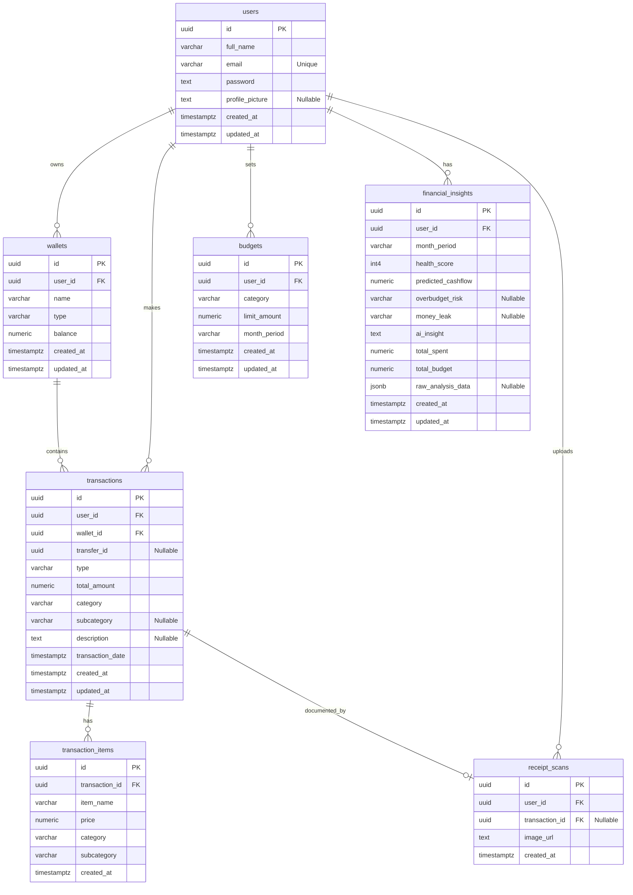
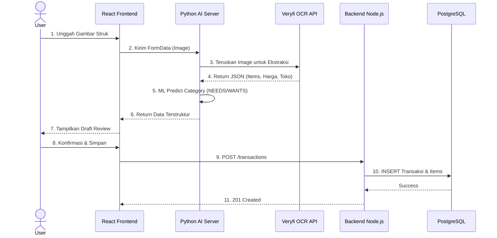
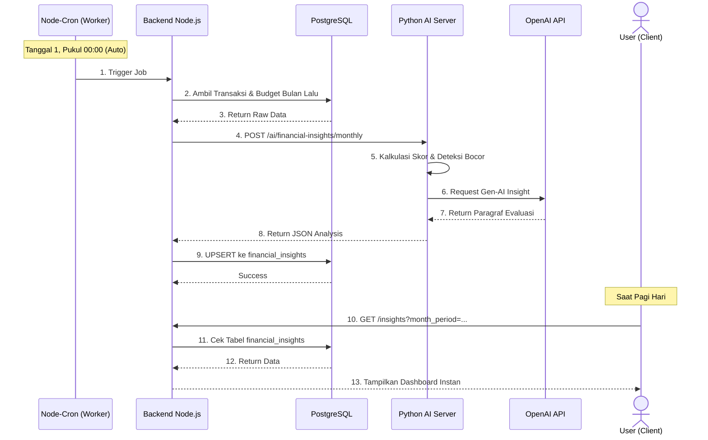

# MyFinance System Architecture

Dokumen ini menjelaskan arsitektur *end-to-end* dari sistem **MyFinance**, mencakup diagram interaksi antar layanan (Frontend, Backend Node.js, AI Service, Database) serta Skema Database (ERD).

---

## 🌐 1. High-Level System Architecture

Aplikasi MyFinance menggunakan arsitektur *microservices-lite*, yang memisahkan antara antarmuka pengguna (Frontend), logika bisnis utama (Backend Node.js), dan layanan komputasi/Data Science (Python AI Server).

```mermaid
graph TD
    %% Define Styles
    classDef frontend fill:#3b82f6,stroke:#1d4ed8,stroke-width:2px,color:#fff
    classDef backend fill:#10b981,stroke:#047857,stroke-width:2px,color:#fff
    classDef ai fill:#f59e0b,stroke:#b45309,stroke-width:2px,color:#fff
    classDef db fill:#6366f1,stroke:#4338ca,stroke-width:2px,color:#fff
    classDef thirdparty fill:#6b7280,stroke:#374151,stroke-width:2px,color:#fff

    %% Nodes
    User([👤 User / Client])
    
    subgraph Frontend [UI Layer - Vercel]
        ReactUI(React.js + Vite Web App):::frontend
    end

    subgraph Backend [Backend Layer - Railway]
        NodeAPI(Node.js Express API):::backend
        CronJob(Node-Cron Worker):::backend
    end

    subgraph AIService [Data Science Layer - Railway]
        PythonAPI(FastAPI / Flask AI Server):::ai
        Streamlit(Streamlit Dashboard):::ai
    end

    subgraph DatabaseLayer [Database & Storage - Supabase]
        PostgreSQL[(PostgreSQL DB)]:::db
        S3Storage[(Object Storage)]:::db
    end

    subgraph External [Third-Party APIs]
        Veryfi(Veryfi OCR API):::thirdparty
        OpenAI(OpenAI GPT-4o-mini):::thirdparty
    end

    %% Connections
    User <-->|HTTPS/REST| ReactUI
    User <-->|HTTPS (Iframe/Link)| Streamlit
    
    ReactUI <-->|REST API + JWT| NodeAPI
    ReactUI -.->|Direct Upload (Fallback)| S3Storage
    
    NodeAPI <-->|SQL Queries| PostgreSQL
    NodeAPI -->|Upload Image| S3Storage
    NodeAPI <-->|Internal API Key| PythonAPI
    NodeAPI -->|Scan Receipt| Veryfi
    
    CronJob -->|Trigger Monthly| NodeAPI
    
    PythonAPI <-->|Generative AI Prompt| OpenAI
    Streamlit <-->|Fetch Raw Data| NodeAPI
```

### Penjelasan Komponen:
1. **Frontend (React.js + Vite):** Menyajikan UI interaktif (Dashboard, Input Transaksi, Laporan). Di-deploy di **Vercel**.
2. **Backend Node.js (Express):** Menangani Autentikasi JWT, CRUD transaksi/dompet, serta integrasi layanan. Di-deploy di **Railway**.
3. **Python AI Server:** Menangani Machine Learning (Prediksi Kategori) dan NLP (Generative AI Insight). Terhubung dengan OpenAI API.
4. **Streamlit Dashboard:** Antarmuka khusus Data Science untuk memvisualisasikan data lanjutan. Menarik data mentah lewat Node.js API endpoint (`/export/streamlit`).
5. **Database & Storage (Supabase):** Menyimpan relasi entitas di PostgreSQL dan file gambar struk di Supabase Storage (Bucket: `receipt_scan`).
6. **Veryfi OCR:** Digunakan untuk mengekstrak data dari gambar struk (Receipt) menjadi format JSON yang terstruktur.

---

## 🗄️ 2. Database Schema (Entity-Relationship Diagram)

Skema database relasional (PostgreSQL) MyFinance berpusat pada relasi antar Pengguna, Dompet, dan Transaksi.



### 🗃️ Data Dictionary (Rincian Tabel)

#### 1. Table `users`
| Name | Type | Constraints |
|------|------|-------------|
| `id` | `uuid` | Primary |
| `full_name` | `varchar` |  |
| `email` | `varchar` | Unique |
| `password` | `text` |  |
| `profile_picture` | `text` | Nullable |
| `created_at` | `timestamptz` | Nullable |
| `updated_at` | `timestamptz` | Nullable |

#### 2. Table `wallets`
| Name | Type | Constraints |
|------|------|-------------|
| `id` | `uuid` | Primary |
| `user_id` | `uuid` | Foreign Key |
| `name` | `varchar` |  |
| `type` | `varchar` |  |
| `balance` | `numeric` |  |
| `created_at` | `timestamptz` | Nullable |
| `updated_at` | `timestamptz` | Nullable |

#### 3. Table `budgets`
| Name | Type | Constraints |
|------|------|-------------|
| `id` | `uuid` | Primary |
| `user_id` | `uuid` | Foreign Key |
| `category` | `varchar` |  |
| `limit_amount` | `numeric` |  |
| `month_period` | `varchar` |  |
| `created_at` | `timestamptz` | Nullable |
| `updated_at` | `timestamptz` | Nullable |

#### 4. Table `transactions`
| Name | Type | Constraints |
|------|------|-------------|
| `id` | `uuid` | Primary |
| `user_id` | `uuid` | Foreign Key |
| `wallet_id` | `uuid` | Foreign Key |
| `transfer_id` | `uuid` | Nullable |
| `type` | `varchar` |  |
| `total_amount` | `numeric` |  |
| `category` | `varchar` |  |
| `subcategory` | `varchar` | Nullable |
| `description` | `text` | Nullable |
| `transaction_date` | `timestamptz` |  |
| `created_at` | `timestamptz` | Nullable |
| `updated_at` | `timestamptz` | Nullable |

#### 5. Table `transaction_items`
| Name | Type | Constraints |
|------|------|-------------|
| `id` | `uuid` | Primary |
| `transaction_id` | `uuid` | Foreign Key |
| `item_name` | `varchar` |  |
| `price` | `numeric` |  |
| `category` | `varchar` |  |
| `subcategory` | `varchar` |  |
| `created_at` | `timestamptz` | Nullable |

#### 6. Table `receipt_scans`
| Name | Type | Constraints |
|------|------|-------------|
| `id` | `uuid` | Primary |
| `user_id` | `uuid` | Foreign Key |
| `transaction_id` | `uuid` | Nullable |
| `image_url` | `text` |  |
| `created_at` | `timestamptz` | Nullable |

#### 7. Table `financial_insights`
| Name | Type | Constraints |
|------|------|-------------|
| `id` | `uuid` | Primary |
| `user_id` | `uuid` | Foreign Key |
| `month_period` | `varchar` |  |
| `health_score` | `int4` |  |
| `predicted_cashflow` | `numeric` |  |
| `overbudget_risk` | `varchar` | Nullable |
| `money_leak` | `varchar` | Nullable |
| `ai_insight` | `text` |  |
| `total_spent` | `numeric` |  |
| `total_budget` | `numeric` |  |
| `raw_analysis_data` | `jsonb` | Nullable |
| `created_at` | `timestamptz` | Nullable |
| `updated_at` | `timestamptz` | Nullable |

### Penjelasan Relasi:
- **`users` (1) ↔ (N) `wallets`**: Satu pengguna bisa memiliki banyak dompet (CASH, BANK, dll).
- **`users` (1) ↔ (N) `transactions`**: Semua histori transaksi terkait langsung dengan akun pengguna.
- **`wallets` (1) ↔ (N) `transactions`**: Setiap transaksi (selain Transfer antar-user) memotong/menambah saldo dompet spesifik.
- **`transactions` (1) ↔ (N) `transaction_items`**: Satu struk pembelanjaan (transaksi) dapat memiliki banyak rincian barang (items) dari hasil scan OCR.
- **`users` (1) ↔ (N) `budgets`**: Pengguna mengatur target pengeluaran (anggaran) spesifik tiap kategori per bulan (`month_period`).
- **`users` (1) ↔ (N) `financial_insights`**: Rapor keuangan bulanan yang di-generate oleh AI secara asinkron menggunakan *cron-job*.

---

## 🔄 3. Flowchart Proses Unggulan

### 📸 A. Alur OCR Scan Struk

Proses ini menjelaskan bagaimana pengguna dapat mengunggah struk belanja dan mendapatkan hasil ekstraksi beserta prediksi kategorinya (via *Machine Learning*).



### 🤖 B. Alur Monthly AI Insight (Cron Job)

Alur ini berjalan sepenuhnya di *background* pada setiap pergantian bulan, menghemat waktu tunggu (*loading time*) pengguna saat melihat analisis di pagi hari.


